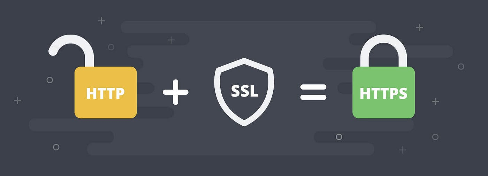
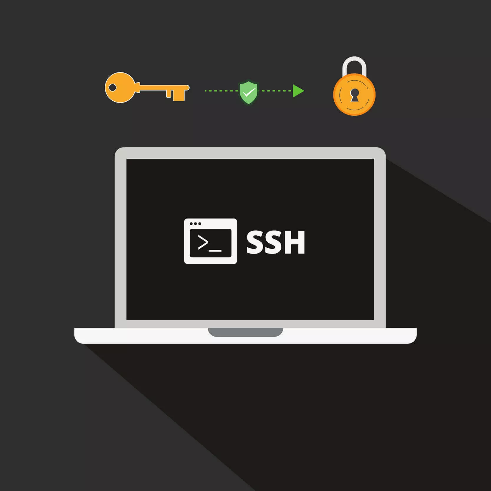

# Scesi-Postulation
_Scesi postulation 2026_
_Trabajo individual_
_Mateo Fabian Gonzales Jimenez_

---

# Apuntes Completos de Git & GitHub

##  Clase 1: Introducción y Configuración
### ¿Qué es Git?
Git es un **MVC (Model Version Control)** o Sistema de Control de Versiones.
Es una herramienta que realiza seguimiento a los cambios de los archivos a lo largo del tiempo, permitiendo:
* Revertir a versiones anteriores.
* Colaborar con otros desarrolladores.
* Gestionar diferentes ramas de código.

### Historia de Git
* **1990:** Primeras herramientas que son RCS y CVS.
* **2005:** Linus Torvalds crea Git.
  
* **2008:** Lanzamiento de GitHub.
* **2018:** Microsoft adquiere GitHub.

### Instalación y Configuración Inicial
* **Descarga:** [git-scm.com](https://git-scm.com/install/)
* **Linux (Arch/EndevourOS (My os)):** `sudo pacman -S git`
* **Verificación:** `git --version`

#### Comandos de configuración global:
| Comando | Descripción |
| :--- | :--- |
| `git config --global user.name "Tu Nombre"` | Configura un nombre de usuario |
| `git config --global user.email "tu@correo.com"` | Configura un correo electrónico |
| `git config --global core.autocrlf true` | Maneja finales de línea automáticamente |

---

## Clase 2: Estados, Flujo de Trabajo y Commits
Git gestiona los archivos a través de tres áreas principales:

### 1. Directorio de Trabajo
Donde creas o modificas archivos.
* **Untracked:** Archivos nuevos que Git aún desconoce.
* **Modified:** Archivos que Git ya rastrea pero han sido modificados.
* **Comando:** `git restore <archivo>` descarta cambios y vuelve al estado original.


### 2. Stage Area
El área de espera para los archivos que quieres incluir en el siguiente "punto de guardado".
* **Agregar:** `git add <archivo>` o `git add .` para todo.
* **Quitar de Stage:** `git restore --staged <archivo>`.

### 3. Repositorio Local (Committed)
Donde se guarda el historial definitivo.
* **Crear commit:** `git commit -m "mensaje"`
* **Modificar último commit:** `git commit --amend`
* **Deshacer último commit:** `git reset --soft HEAD~1` mantiene los cambios en stage.

### El archivo `.gitignore`
Sirve para listar archivos o carpetas que Git debe ignorar o no rastrear.
* `*.log`: Ignora todos los archivos de registro.
* `node_modules/`: Ignora carpetas de dependencias.
* `secrets.env`: Ignora archivos con credenciales.

### Buenas Prácticas de Commits
* **Frecuencia:** Hacer commits pequeños y atómicos o sea un cambio lógico a la vez.
* **Mensajes:** Máximo 50 caracteres, sin punto final, usando verbos imperativos `Add`, `Fix`, `Remove`.
* **Prefijos Semánticos:**
    * `feat`: Nueva funcionalidad.
    * `fix`: Corrección de errores.
    * `docs`: Documentación.
    * `refactor`: Mejora de código sin cambiar funcionalidad.
    * `perf`: Mejoras de rendimiento.

---

## Clase 3: GitHub y Conexión Remota
### ¿Qué es GitHub?
Es una plataforma en la nube la "red social de programadores" que permite alojar repositorios de Git y colaborar con otros.

### Protocolos de Conexión
1. **HTTPS:** Fácil de usar, pero requiere autenticación frecuente o token personal.
    
3. **SSH:** Usa claves criptográficas. Más seguro y profesional; no pide contraseña tras la configuración inicial.
    
5. **CLI (gh):** Herramienta de línea de comandos de GitHub para mayor productividad.
    .jpg)

### Configuración SSH
1. **Generar:** `ssh-keygen -t ed25519 -C "correo@ejemplo.com"`
2. **Verificar clave pública:** `cat ~/.ssh/id_ed25519.pub`
3. **Vincular:** Copiar el contenido en *Settings > SSH keys* en GitHub.
4. **Probar:** `ssh -T git@github.com`

### Conectar Local con Remoto
Si ya tienes un proyecto local:
```bash
git remote add origin <url-del-repo>
git branch -M main
git push -u origin main
```

---

## Clase 4: Remotos Avanzados y Múltiple SSH
### Gestión de Remotos
* `git remote -v`: Ver conexiones actuales.
* `git remote set-url origin <nueva-url>`: Cambiar la dirección del repositorio remoto.

### Configuración de Múltiples Cuentas SSH
Para usar una cuenta de trabajo y una personal en la misma PC, se edita el archivo `~/.ssh/config`:
```text
Host github-personal
    HostName github.com
    IdentityFile ~/.ssh/id_ed25519_personal

Host github-trabajo
    HostName github.com
    IdentityFile ~/.ssh/id_ed25519_trabajo
```

### Jerarquía de Configuración
1. **Local:** `--local` Solo el repositorio actual. **Mayor prioridad.**
2. **Global:** `--global` Para el usuario del sistema.
3. **System:** Para todos los usuarios de la máquina.

---
## Clase 5: Ramas, Navegación y Gitflow
### Ramas
Permiten crear "universos alternos" para probar funciones sin romper la rama principal (`main`).
* **Crear y cambiar:** `git switch -c <nombre-rama>` o `git checkout -b <nombre-rama>`.
* **Cambiar a rama existente:** `git switch <nombre>` o `git checkout <nombre>`.

### Navegación por Commits
* **Ver historial:** `git log --oneline`.
* **Viajar al pasado:** `git checkout <id-commit>`.
    * **Detached HEAD:** Ocurre cuando apuntas a un commit y no a una rama. Para guardar cambios aquí, usa `git checkout -b nueva-rama`.
* **Regresar definitivamente:** `git reset --hard <id-commit>`.

### Gitflow
* **Ramas Principales:** `main` producción y `develop` desarrollo.
* **Ramas Secundarias:** `feature/` nuevas funciones, `release/` preparar versiones y `hotfix/` arreglos urgentes.

### Sincronización
* **Pull:** `git pull origin <rama>` Baja cambios y los fusiona.
* **Push:** `git push origin <rama>` Sube tus commits.

---

# Clase 6: Git y Flujos de Trabajo

Esta sesión se enfoca en los comandos esenciales para la colaboración y el manejo de ramas en Git, así como en un flujo de trabajo estándar sin el uso de Pull Requests.

## 1. Comandos Principales

### Git Merge
Permite fusionar los cambios de una rama en otra.
* **Flag `--no-ff` (No Fast Forward):** Fuerza la creación de un *merge commit* incluso si Git pudiera realizar la unión de forma lineal. Esto es vital para mantener la visibilidad del historial de la rama, permitiendo saber que existió aunque sea borrada posteriormente.

### Git Fetch
Consulta si existen cambios en el repositorio remoto (commits, archivos o referencias) pero **no los descarga** ni los integra en tu código local. Solo actualiza la información para que estés al tanto de las novedades.

### Git Pull
Trae y fusiona los cambios del repositorio remoto directamente a tu rama actual. Es, en esencia, la combinación de `git fetch` + `git merge`.
* **Uso:** `git pull origin <nombre_de_la_rama>`

### Git Push
Sube tus cambios locales al repositorio remoto.
* **Uso inicial:** La primera vez que subes una rama, se recomienda usar el flag `-u` para establecer el seguimiento:
    `git push -u origin <nombre_de_la_rama>`

---

## 2. Flujo de Trabajo (Sin Pull Requests)

Este flujo se utiliza habitualmente para integrar cambios directamente en una rama común (como `develop`) desde ramas de características individuales.

### Paso 1: Actualizar la rama base
Antes de empezar, asegúrate de que tu rama local `develop` esté al día:
```bash
git checkout develop
git fetch
git pull origin develop
```

### Paso 2: Integrar cambios en tu rama (opcional)
Si hubo cambios en `develop`, llévalos a tu rama de trabajo para evitar conflictos mayores al final:
```bash
git checkout <tu-rama>
git merge develop
```

### Paso 3: Trabajar y subir cambios
Realiza tus commits y sube tu rama al servidor:
```bash
git push origin <tu-rama>
```

### Paso 4: Fusión final en Develop
Para integrar tu trabajo de forma permanente:
1. Regresa a `develop` y asegúrate de que siga actualizada.
2. Realiza el merge con `--no-ff`.
```bash
git checkout develop
git pull origin develop
git merge --no-ff <tu-rama>
```

### Paso 5: Resolución de conflictos y limpieza
Si hay conflictos durante el merge:
1. Edita los archivos manualmente para resolver las diferencias.
2. Marca los archivos como resueltos: `git add .`
3. Finaliza la fusión: `git commit` (se abrirá un editor como Vim/Nano para confirmar el mensaje).
4. Borra la rama auxiliar: `git branch -d <tu-rama>`
5. Sube el resultado final al servidor: `git push origin develop`

---

## Clase 7: Pull Requests (PR) y Colaboración
El **Pull Request** no es un comando de Git, sino una funcionalidad de plataformas como GitHub para revisar código antes de integrarlo.

### 1. El flujo de trabajo profesional
En entornos reales (o en proyectos de robótica colaborativos), nunca se hace push directo a `main`. El flujo es:
1. **Sincronizar:** `git checkout develop` + `git pull origin develop`.
2. **Rama de feature:** `git checkout -b feature/nueva-mejora`.
3. **Push inicial:** `git push -u origin feature/nueva-mejora`.
4. **Abrir PR:** En GitHub, comparas tu rama con `develop`.
5. **Code Review:** Otros revisan, comentan y aprueban.
6. **Merge:** Se integra en la nube y luego borras la rama local con `git branch -D`.

### 2. Forking: Colaborar en proyectos ajenos
Si quieres contribuir a un repositorio donde no tienes permisos de escritura:
* Haces un **Fork** (copia a tu cuenta).
* Clonas tu fork, haces los cambios y subes a *tu* remoto.
* Abres un PR desde tu fork hacia el repositorio original.

---

## Clase 8: Herramientas de Inspección y Emergencias
Aquí es donde Git se vuelve un "salvavidas" para el código.

### 1. Git Stash: El "armario" temporal
Si necesitas cambiar de rama urgentemente pero tienes trabajo a medio hacer y no quieres hacer un commit "sucio":
* `git stash`: Guarda tus cambios actuales y deja el directorio limpio.
* `git stash list`: Mira qué tienes guardado.
* `git stash pop`: Recupera los cambios y los borra del stash.
* `git stash apply`: Los aplica pero mantiene la copia en el stash.

### 2. Git Diff: ¿Qué rompí?
Antes de hacer un `git add`, es vital revisar qué cambió exactamente:
* `git diff`: Cambios en el directorio de trabajo (no stagiados).
* `git diff --staged`: Cambios ya agregados al stage que están listos para el commit.
* `git diff rama1 rama2`: Compara dos ramas completas.

### 3. Resolución de Conflictos en PRs
Si alguien hizo merge de un cambio que toca tus mismas líneas:
1. Traes lo nuevo: `git fetch origin`.
2. Fusionas la rama base en la tuya: `git merge origin/develop`.
3. **Manual fix:** Git marcará los archivos. Debes elegir entre *Current Change*, *Incoming Change* o ambos.
4. Finalizas: `git add .` + `git commit`.

---

## Resumen de Comandos

| Acción | Comando |
| :--- | :--- |
| **Limpieza temporal** | `git stash` |
| **Recuperar archivos** | `git restore <file>` |
| **Historial compacto** | `git log --oneline --graph --all` |
| **Comparar ramas** | `git diff main..develop` |
| **Borrado remoto** | `git push origin --delete <rama>` |

---

---

# Buenas Prácticas

* Commits pequeños
* PRs claros
* No push directo a main
* Eliminar ramas tras merge

---

# Conclusión

Git y GitHub son herramientas esenciales para desarrollo moderno y trabajo colaborativo la verdad son herramientas altamente eficientes en su trabajo y con una curva de aprendizaje bastante alta pero satisfactoria.
Tambien quiero pedir disculpas por la falta de contenido y el alto uso de ia para reorganizar la información de mis apuntes, si no estoy mal cuento con una falta segun el form de asistencia pero es unicamente por no estar atento durante esa clase, todo lo demás muchas gracias auxi este curso fue muy divertido y entretenido, me gustaria seguir aprendiendo de usted

---

